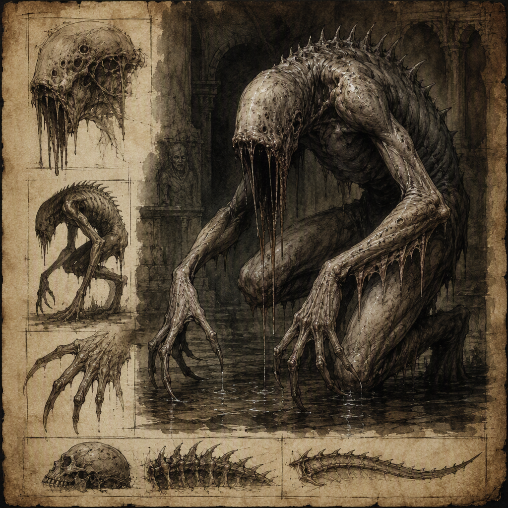

# Weeping Lurker (creature)

The **[[Weeping Lurker]]** is a nocturnal ambusher associated with concealed attacks in darkness. Its danger is expressed through waiting rather than open pursuit, and accounts describe it as mournful, patient, and unnervingly still. The creature has a hidden, indistinct form accompanied by the unmistakable image of weeping. The [[Weeping Lurker]] lairs in [[Embermarch]] and was unleashed in [[The Purge of Blackport]].

## Infobox

| Field | Value |
|---|---|
| Name | [[Weeping Lurker]] |
| Type | Creature |
| Habit | Nocturnal ambusher |
| Lair | [[Embermarch]] |
| Appearance | Hidden, indistinct form accompanied by the unmistakable image of weeping |
| Demeanor | Mournful, patient, and unnervingly still |
| Danger | Concealed attacks in darkness; waiting rather than open pursuit |
| Historical association | Unleashed in [[The Purge of Blackport]] |

## History

The history of the [[Weeping Lurker]] is defined less by open activity than by concealed presence. It is a nocturnal ambusher, and its appearances are associated with darkness, waiting, and attacks that are difficult to anticipate. Rather than pursuing its victims openly, the creature allows danger to gather around its stillness. This quality has made the [[Weeping Lurker]] difficult to distinguish from the darkness in which it operates.

The [[Weeping Lurker]] lairs in [[Embermarch]]. This association is central to its known history, although the available record describes the creature’s lair only in general terms. Its hidden, indistinct form reinforces the impression that it belongs to places where visibility is uncertain and where an observer may sense a presence without clearly seeing its source.

The [[Weeping Lurker]] was unleashed in [[The Purge of Blackport]]. This event is the principal historical circumstance connected with the creature in the surviving record. The wording of the record identifies the creature as having been unleashed, while providing no further account of the circumstances surrounding that act. Its appearance in this context is consequently remembered through the same qualities that define the creature elsewhere: darkness, concealment, waiting, and the image of weeping.

No account presents the [[Weeping Lurker]] as a creature of open pursuit. Its danger lies in the interval before an attack, when it remains present but indistinct. The absence of visible movement is therefore not treated as evidence of absence. Instead, stillness forms part of the creature’s recognized behavior.

## Relationships & Affiliations

No relationship or affiliation is recorded for the [[Weeping Lurker]]. The creature is described through its habit, appearance, demeanor, lair, and historical association rather than through allegiance to any named power or group.

Its connection to [[Embermarch]] is geographical rather than an affiliation. The [[Weeping Lurker]] lairs in [[Embermarch]], but the record does not assign the creature to any household, order, settlement, or faction. Similarly, its unleashing in [[The Purge of Blackport]] establishes a historical association without identifying a lasting bond or allegiance.

This absence of recorded affiliation is consistent with the creature’s nature. A being whose presence is hidden and whose attacks are concealed does not present itself through banners, proclamations, or open advance. The [[Weeping Lurker]] is recognized by the signs surrounding its presence rather than by declared loyalties. Its mournful aspect, patience, and unnerving stillness form a more reliable means of identification than any association with an organized power.

The name itself does not establish a relationship with any other entity. It describes the image accompanying the creature’s indistinct form: unmistakable weeping perceived in connection with a presence that remains concealed. The record therefore treats the [[Weeping Lurker]] as an independent creature category rather than as a title, office, or known servant-name.

## Tactical Assessment

The primary danger of the [[Weeping Lurker]] is concealed attack in darkness. Its nocturnal ambusher habit places emphasis on timing and concealment rather than speed or visible aggression. The creature waits. That waiting is not incidental to its behavior; it is the principal expression of its threat.

The [[Weeping Lurker]]’s hidden, indistinct form complicates recognition. The appearance associated with it is not a clearly described body but the unmistakable image of weeping. This distinction is important in accounts of the creature. The observer may recognize the sign of grief while remaining unable to identify the form that produces it. The image of weeping consequently functions as the creature’s clearest visible indication, even though the creature itself remains indistinct.

Its demeanor is mournful, patient, and unnervingly still. These traits should be considered together. Mournfulness gives the creature its emotional character; patience describes its willingness to remain in place; stillness makes that patience unnerving. None of these qualities suggests open pursuit. Instead, they describe a threat that persists through silence and delay.

The known tactical pattern of the [[Weeping Lurker]] can therefore be summarized as concealment followed by waiting. Darkness provides the setting associated with its attacks, while stillness preserves the uncertainty surrounding its location. The creature’s danger is greatest where its presence cannot be clearly separated from the surrounding dark.

This assessment does not establish additional methods or capabilities beyond those recorded. The [[Weeping Lurker]] is known as a nocturnal ambusher whose concealed attacks are associated with darkness. Its defining advantage is the fear produced by an unseen, waiting presence, not any documented display of open pursuit.

## Legacy

The [[Weeping Lurker]] is remembered through a combination of place, event, and image. [[Embermarch]] provides its recorded lair, while [[The Purge of Blackport]] provides the historical event in which it was unleashed. Between these two associations stands the creature’s defining image: weeping perceived alongside an indistinct form in darkness.

Its legacy is consequently one of anticipation. The [[Weeping Lurker]] does not require a visible chase to inspire fear. The possibility that it is waiting is sufficient to make darkness significant. Because it is mournful rather than openly violent in its presentation, the creature carries an atmosphere of grief as well as danger.

The image of weeping also distinguishes the [[Weeping Lurker]] from a simple unseen attacker. Its presence is not merely hidden; it is accompanied by a recognizable emotional impression. The sorrow associated with that image does not lessen the threat. Instead, it makes the creature’s stillness more unsettling, joining grief to concealment and patience to attack.

In catalogues of creatures, the [[Weeping Lurker]] is therefore defined by what cannot be readily seen. Its form is hidden and indistinct, its movements are governed by waiting, and its attacks are concealed in darkness. The known record provides no need for open pursuit to explain its danger. The [[Weeping Lurker]] remains threatening precisely because it can be present without becoming plainly visible.